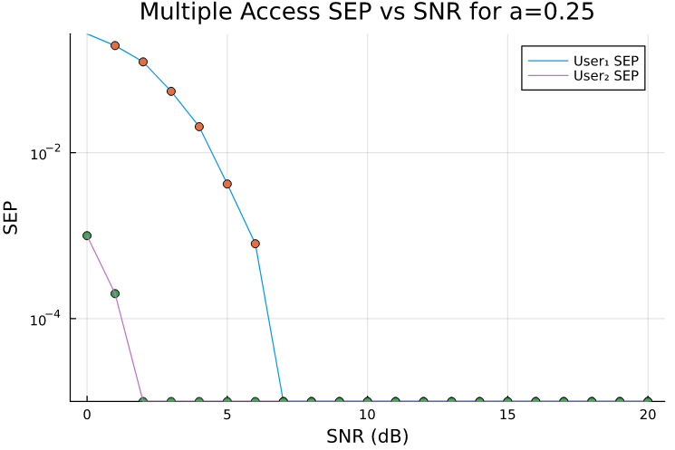
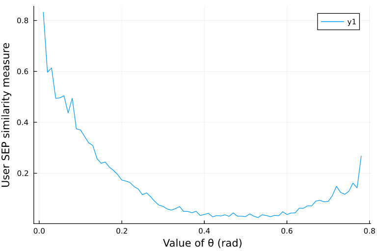

# Constellation Based Multiple Access

This project explores different methods of implementing Con-NOMA (Constellation-based Non-Orthogonal Multiple Access) and providing simulations results and optimization.

## Uniform M-PAM Multiple Access

The first Con-NOMA system this report is going to investigate is one using two uniform M-
PAM constellations and composing them in an orthogonal manner, creating an M1 ∗ M2 -QAM
constellation. This is described as follows:
The transmitter uses 2 uniform M-PAM constellations, one as the I component and the latter
as the Q component of a QAM modulation, in order to transmit to 2 users simultaneously. More
specifically if the first M-PAM’s symbols are s1 and the second M-PAM’s s2 , the transmitter
essentially composes them "orthogonally" and transmits symbols in the form of:

$$ s = s_1 + js_2 $$

This is implemented in `PAM.jl` with
```julia
function orthogonalComposition(mPAM1::M_PAM, mPAM2::M_PAM)
```

Given a sample system of
- Two uniform 4-PAM constellations
- Average Symbol Energy ($E_s$): $E_{s1} = a$, $E_{s2} = 1 - a$

Starting with an $a = 0.25$, this Con-NOMA contellation is produced


A simulation on a range of SNR levels will be ran in
order to characterize the SEP (Symbol Error Probability) values of each user. In our model, it is assumed that the two users receive the signal at different noise levels.
More specifically the noise added to the received complex symbol follows a complex normal
distribution which is $CN(0, \frac{N_0}{2})$ for User 1 and CN(0, \frac{cN_0}{2}) for User 2, with $c = 0.5$. A Maximum Likelihood Detector (MLD) is used for symbol detection.



#### Optimization for User Fairness

Here we aim to find the optimal value of $a$ , which would accomplish
user fairness over a range of SNR values. This can be achieved by comparing the SEP functions
of the two users over the range of SNR values. Thus, a simulation will
be conducted for multiple values of $a \in (0, 1)$ where the optimization objective function would be:

$$ \mathcal{M} = \sum_{i = 0}^{20} |SEP_1(i) - SEP_2(i)| $$


A value of $a = 0.78$ seems to be optimal for user fairness in this method also seen in the plot below


## Constellation Rotation Multiple Access

The second Con-NOMA system under investigation is one using a QAM constellation that is
rotated by some angle $\theta \in (0, \pi/2)$ around it’s center. The transmitter uses the rotated QAM constellation to generate two M-PAM constellations
orthogonal to each other, by projecting the rotated symbols to the imaginary and real axes. Then these two are used to "orthogonally" compose an orthogonal QAM constellation in the
same manner as System 1. This method of Con-NOMA is also described in [^1].
Then on the receiving side, each of the users only receives one of the components, with the
first user isolating the real part and the second isolating the imaginary part, the same way as it
is described in system 1.

This is implemented in `PAM.jl` with
```julia
function rotationComposition(c::Constellation, θ::Real)
```

Thus, given the system’s requirements an orthogonal uniform 4-QAM constellation will be
used. Below a sample constructed constellation is shown, for a rotation angle θ = 0.2 rad


A SEP simulation is also conducted


#### Optimization for User Fairness

n the same way as for the previous system, we are going to conduct simulations for the optimization of the value of the rotation angle θ. We are going to use the same measure ($\mathcal{M}$)



As it is also shown in the figure above, the optimal value of θ that ensures user fairness is
around 0.45 rad or 26.35 $^\circ$ . This result is also proved analytically and presented in [^1]

## Conclusions

<p float="left">
  
  
</p>

The first system seems more efficient than the second because:
- The SEP is generally lower, and it drops to it’s minimum at around 3 dB
- Both users are subjected to almost the exact same SEP, ensuring user fairness


[^1]: A. Chauhan and A. Jaiswal, “Non-orthogonal multiple access: A constellation domain multi-
plexing approach,” in 2020 IEEE 31st Annual International Symposium on Personal, Indoor
and Mobile Radio Communications. IEEE, Aug. 2020.
